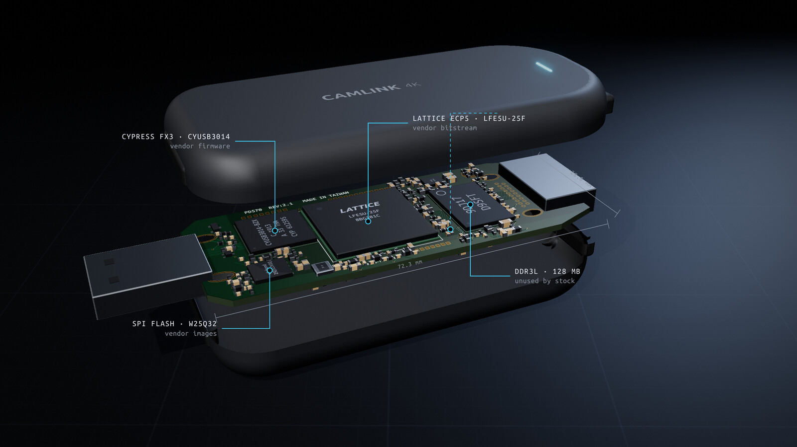
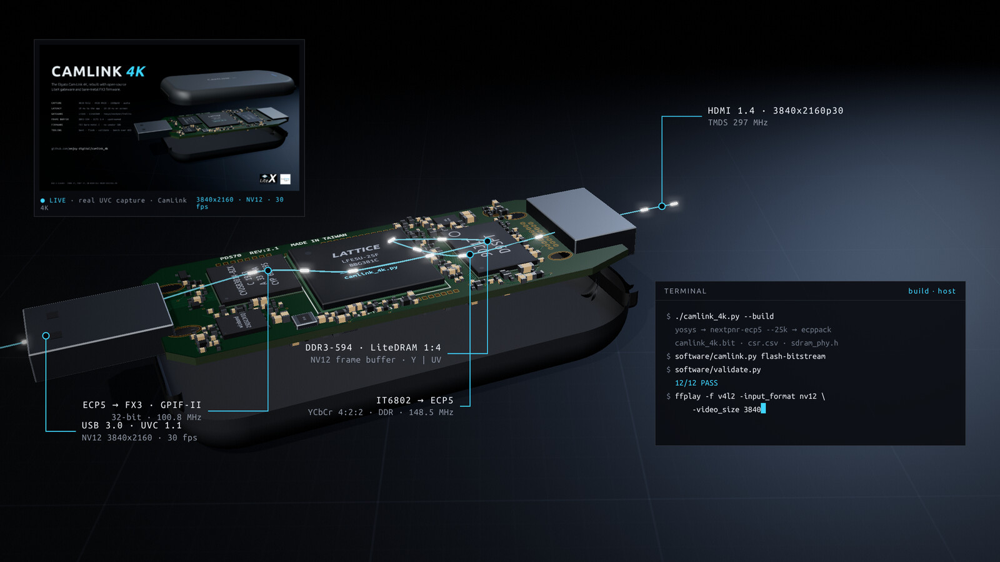
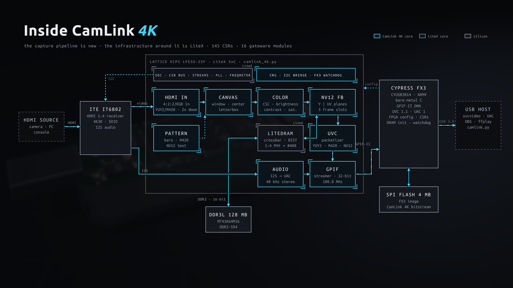
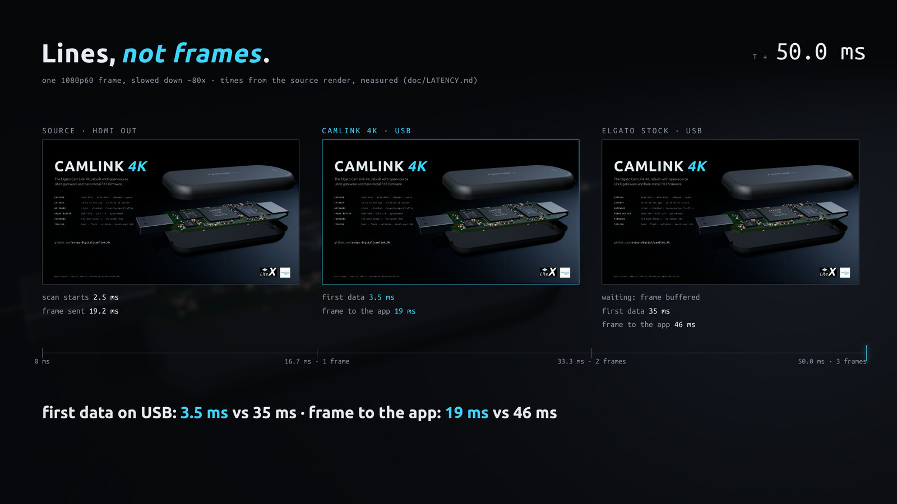
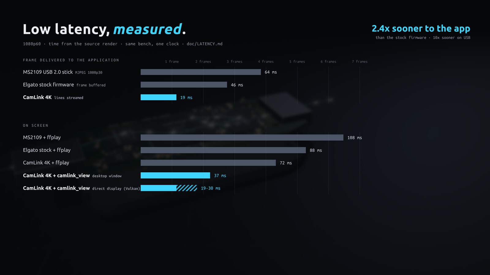
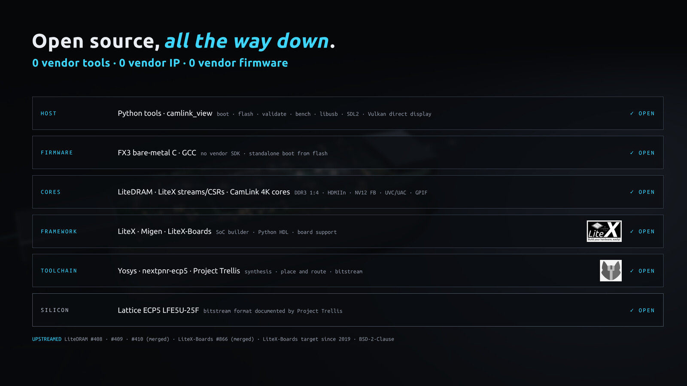
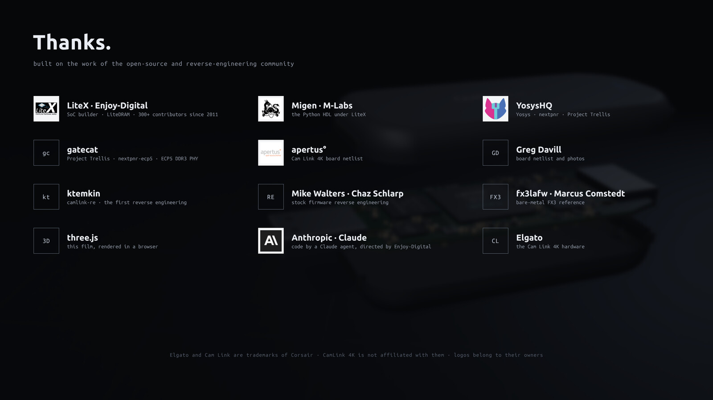

# CamLink 4K

https://github.com/user-attachments/assets/6385cdc9-6985-4505-b17b-bf5836295ad3

<sub>▶ Promo video (66 s, with sound: rendered with three.js and a synthesized soundtrack from
[`doc/illustration`](doc/illustration)). Also as [mp4](doc/images/camlink_4k.mp4) and
[still](doc/images/camlink_4k-hires.jpg).</sub>

**CamLink 4K**: open gateware and firmware for the **Elgato Cam Link 4K** (1st gen,
USB `0fd9:0066`), a real UVC/UAC capture card that goes further than the stock firmware on the same
hardware:

- **One Python script**: LiteX/Migen gateware for the Lattice ECP5 LFE5U-25F, open toolchain
  (Yosys/nextpnr/Trellis), no vendor bitstream.
- **No vendor firmware**: minimal bare-metal C for the Cypress FX3 (no SDK), standalone boot from
  the SPI flash.
- **4K30 NV12** through an open DDR3 frame buffer (LiteDRAM, DDR3-594 at 1:4), 4K30 M420, 1080p60
  YUY2 with scaling/crop/color controls, HDMI audio (UAC).
- **Upstream**: ECP5 DDR3 1:4 contributed to LiteDRAM/LiteX-Boards.
- **Low latency**: lines streamed as they are received (first data on USB ~3.5 ms after the source
  render, frame delivered to applications in 19 ms at 1080p60 vs 46 ms stock), low latency viewer
  with direct display (19-30 ms on screen), see [doc/LATENCY.md](doc/LATENCY.md).
- **Host tools**: Python tools to boot, flash, debug, validate and benchmark the device over USB
  (made for agentic development: video/audio in, CSRs/flash/FPGA control out).

> Status: working capture card, validated on hardware (`software/validate.py`), see
> [doc/PLAN.md](doc/PLAN.md) and [doc/DRAM.md](doc/DRAM.md). Supported: the **1st gen** Cam Link 4K
> only (`0fd9:0066`/`0067`); the Cam Link 4K MK.2 (`0fd9:007b`) and Rev.3 (`0fd9:00a1`) are
> different designs.

## Inside

| Vendor code out | HDMI → DDR3 → USB |
|:---:|:---:|
| [](doc/images/camlink_4k-inside.jpg) | [](doc/images/camlink_4k-datapath.jpg) |
| Lattice ECP5 (LiteX gateware), Cypress FX3 (bare-metal C), ITE IT6802 HDMI receiver, 128 MB DDR3L, SPI flash. | 4K30 through the open NV12 frame buffer in DDR3, out as UVC over USB 3.0 (the window is a real capture). |

## Architecture

[](doc/images/camlink_4k-architecture.jpg)

The ECP5 runs one LiteX SoC ([`camlink_4k.py`](camlink_4k.py)): the IT6802 video is captured (`HDMIIn`),
cropped/scaled (`Canvas`), color adjusted (`ColorAdjust`), written as NV12 planes to DDR3
(`NV12FrameBuffer` on LiteDRAM), read back into UVC payloads (`UVCPacketizer`) and sent with the
I2S audio (`AudioSource`) to the FX3 over GPIF-II (`GPIFStreamer`). The FX3 firmware
([`firmware`](firmware)) configures the FPGA from the SPI flash, initializes the DRAM,
bridges CSRs and exposes the UVC/UAC interfaces to the host.

```
            +---------+  parallel video  +-----------+  GPIF-II 32-bit  +-------+  USB3
  HDMI ---->| IT6802  |----------------->|   ECP5    |<===============>|  FX3  |<======> Host
            | HDMI RX |  I2S audio       | LFE5U-25F |  Slave-SPI cfg  |       |
            +---------+----------------->|           |<----------------|       |
                 ^                        +-----------+                 +-------+
                 |     I2C (shared)            |  DDR3L 128MB             |  SPI Flash 4MB
                 +-----------------------------+--------------------------+
```

## Low latency

| Lines, not frames | Measured |
|:---:|:---:|
| [](doc/images/camlink_4k-race.jpg) | [](doc/images/camlink_4k-latency.jpg) |

Measured on the same bench with one clock (1080p60, from the source render): frame delivered to
applications in 19 ms (stock firmware 46 ms, a cheap MS2109 USB stick 64 ms), on screen in 35-38 ms with
`camlink_view` in a desktop window and 19-30 ms with direct display (Vulkan, no compositor). Method,
per stage breakdown and tools: [doc/LATENCY.md](doc/LATENCY.md), [doc/COMPARISON.md](doc/COMPARISON.md).

## Open source, all the way down

[](doc/images/camlink_4k-opensource.jpg)

No vendor tool, IP or firmware: the ECP5 bitstream is built with Yosys, nextpnr-ecp5 and Project
Trellis; the SoC with [LiteX](https://github.com/enjoy-digital/litex), [Migen](https://github.com/m-labs/migen)
and [LiteX-Boards](https://github.com/litex-hub/litex-boards); the DDR3 frame buffer with
[LiteDRAM](https://github.com/enjoy-digital/litedram); the FX3 firmware is bare-metal C built with GCC;
the host tools and viewer are open too. CamLink 4K adds the capture pipeline and gives back ECP5 DDR3
at 1:4 to LiteDRAM (#408, #409, #410 merged) and LiteX-Boards (#866 merged), see
[doc/upstream](doc/upstream).

## Docs

- [doc/HARDWARE.md](doc/HARDWARE.md): what is known (and missing) about the hardware.
- [doc/PLAN.md](doc/PLAN.md): phases and status.
- [doc/DRAM.md](doc/DRAM.md): DDR3 1:4 and the NV12 frame buffer.
- [doc/BENCH.md](doc/BENCH.md): test bench setup.
- [doc/LATENCY.md](doc/LATENCY.md): latency measurements, low latency viewer (`software/viewer`), next steps.
- [doc/COMPARISON.md](doc/COMPARISON.md): stock vs CamLink 4K vs a cheap USB 2.0 stick (MS2109), possibilities of each.
- [doc/IDEAS_PCIE.md](doc/IDEAS_PCIE.md): design note, LitePCIe video input/output cards (line based capture, phase locked output, low latency streaming, IP-KVM).
- [doc/ROADMAP.md](doc/ROADMAP.md): improvements and new features.
- [doc/BENCHMARK.md](doc/BENCHMARK.md), [doc/THROUGHPUT.md](doc/THROUGHPUT.md): stock comparison, USB/GPIF throughput.
- [doc/upstream](doc/upstream): LiteDRAM/LiteX-Boards contributions.

## Getting started

> **Warning**: this replaces the firmware of your Cam Link 4K. Back up the full SPI flash first: it
> holds the stock firmware (which this project does not and cannot distribute) and the unit serial
> number. It may void your warranty; use at your own risk. The FX3 boot ROM always offers a USB
> bootloader recovery (see below).

### Requirements

- Linux host (host tools, viewer and udev rules are Linux only).
- FPGA: [LiteX](https://github.com/enjoy-digital/litex), [LiteDRAM](https://github.com/enjoy-digital/litedram)
  and Migen (`litex_setup.py --init --install`, LiteDRAM with #408-#410, e.g. master), Yosys, nextpnr-ecp5 and
  Project Trellis (e.g. [OSS CAD Suite](https://github.com/YosysHQ/oss-cad-suite-build)).
- FX3 firmware: `arm-none-eabi-gcc`.
- Python: `pip3 install -e .` (pyusb, numpy; `.[bench]` adds libusb1, Pillow, scipy, pytest for the
  bench and test tools).
- Viewer (optional): libusb-1.0, SDL2, X11/Xrandr, GL, libdrm, xcb, Vulkan development packages.
- USB access: `sudo cp software/udev/70-camlink.rules /etc/udev/rules.d/ && sudo udevadm control
  --reload-rules && sudo udevadm trigger`.

### Build

```sh
./camlink_4k.py --build                 # Gateware, default NV12 variant (DRAM frame buffer, 4K30 NV12).
./camlink_4k.py --build --variant base  # Without DRAM (YUY2/M420), --output-dir to keep both.
make -C firmware                    # FX3 firmware (uses build/csr.csv: build the gateware first).
make -C software/viewer                 # Low latency viewer (optional).
python3 -m pytest test                  # Simulation and host tests (~20 min).
```

### Install

1. Back up the stock flash with [cl4k-fwtool](https://github.com/schlarpc/elgato-cam-link-4k-firmware-re)
   (stock firmware, vendor HID interface), twice, and compare:
   `sudo ./tools/cl4k-fwtool.py dump flash_a.bin`, `... dump flash_b.bin`, `cmp flash_a.bin flash_b.bin`.
2. Replace the stock FX3 image (flash offset 0) with the CamLink 4K one, with the same tool
   (`flash --mcu firmware/build/fx3.img`, dry run, then `--commit`); the stock bitstream and
   settings are left in place. Power cycle.
3. Load the bitstream, then make the device standalone:

```sh
python3 software/camlink.py boot             # Device in the FX3 bootloader (04b4:00f3) or running our firmware.
python3 software/camlink.py flash-bitstream  # Bitstream at 0x100000 (stock bitstream kept at 0x040000).
python3 software/camlink.py flash-fx3        # FX3 image at 0 (standalone boot).
python3 software/validate.py                 # Hardware checks (capture, audio, controls, 4K30).
```

The device then enumerates as `CamLink 4K` (UVC + UAC): `ffplay -f v4l2 /dev/videoN`, OBS, VLC, or
`software/viewer/camlink_view` (lowest latency, see [doc/LATENCY.md](doc/LATENCY.md)).

### Recovery and back to stock

- `camlink.py flash-recover` erases the FX3 image (block 0): the FX3 boot ROM then falls back to the
  USB bootloader (`04b4:00f3`), where `camlink.py boot` loads the firmware to RAM again.
- A firmware that never enumerates returns to the bootloader by itself (boot watchdog).
- Back to stock: `camlink.py flash-recover` then `camlink.py boot` (firmware running from RAM), then
  `camlink.py flash-write flash_a.bin --force` (whole flash: erase/program/verify), power cycle.
- Stock FX3 image in RAM without touching the flash (comparisons):
  `camlink.py fx3-extract flash_a.bin stock_fx3.img`, then `camlink.py fx3-load stock_fx3.img` from
  the bootloader (`software/fw_switch.py` automates it).

### Known limitations

- 4K is 30 fps maximum (IT6802 HDMI 1.4 receiver); 4K30 as NV12 (through the DDR3 frame buffer,
  up to one more frame of latency) or M420; native 4K YUY2 does not fit USB 3 bandwidth.
- No HDCP sources.
- USB VID/PID: pid.codes test PID `1209:0001` (selected by product string, a dedicated PID is to be
  requested).
- The viewer `--drm` path (RandR lease) is untested; `--vk` (Vulkan direct display) is the tested one.

## Credits

[](doc/images/camlink_4k-credits.jpg)

Builds on the reverse engineering work of ktemkin (camlink-re), Greg Davill and the apertus
team (netlist), Mike Walters, Chaz Schlarp (elgato-cam-link-4k-firmware-re) and Marcus Comstedt
(fx3lafw), on LiteX/LiteDRAM/Migen, and on the open ECP5 toolchain from YosysHQ (Yosys, nextpnr,
Project Trellis). Code written by a Claude agent (Anthropic), directed by
[Enjoy-Digital](https://enjoy-digital.fr).

About the video: the board and enclosure models follow public board and product photos (Greg
Davill, apertus wiki), rendered with [three.js](https://threejs.org); the capture window is a real
4K NV12 frame captured through CamLink 4K; the soundtrack is synthesized by
[`doc/illustration/music.py`](doc/illustration/music.py) (adapted from the TriXium video). The
logos in the credits (LiteX, Enjoy-Digital, M-Labs, YosysHQ, apertus, Anthropic) are used unaltered
for attribution and remain the property of their owners.

## License

BSD-2-Clause, see [LICENSE](LICENSE). Third-party parts: `firmware/rdb/` register definitions
are MIT (Marcus Comstedt, fx3lafw, see [LICENSES](LICENSES)); `doc/pinout.csv` derives from the
apertus/Greg Davill board netlist.

Custom work, 15+ years of FPGA: [enjoy-digital.fr](https://enjoy-digital.fr).

<sub>Elgato and Cam Link are trademarks of Corsair. This project is not affiliated with them.</sub>
